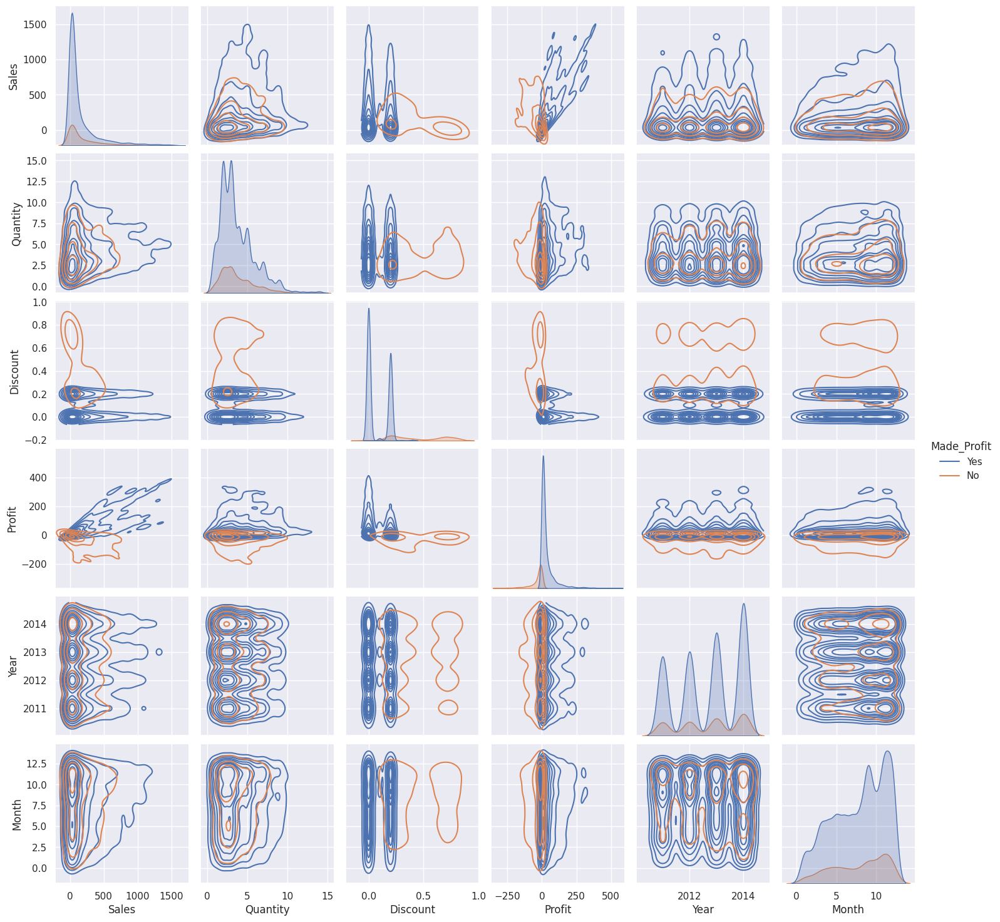
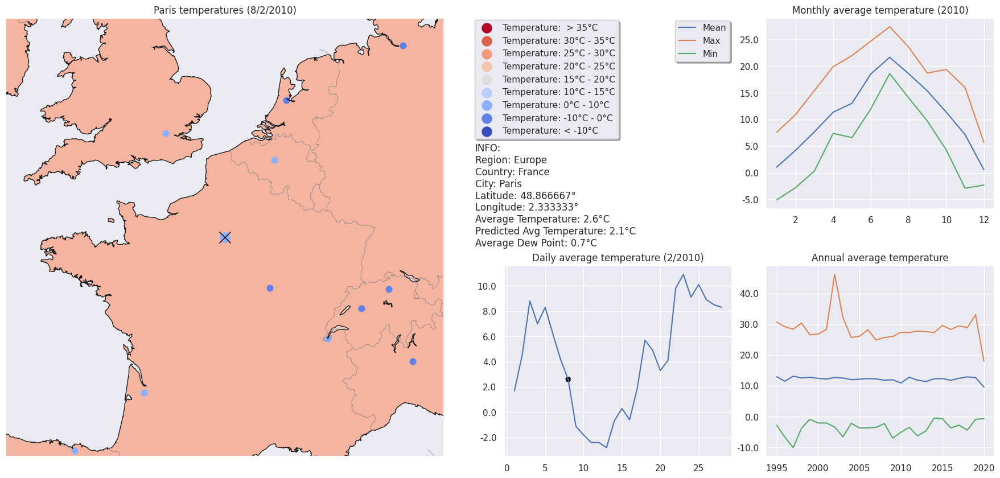
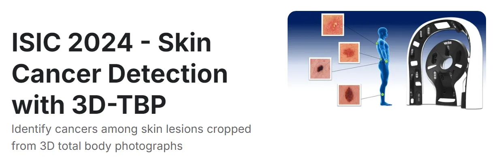
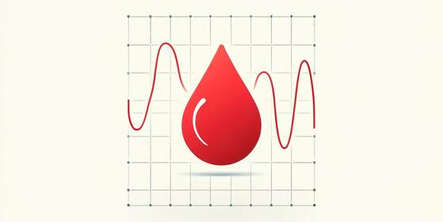

# Selected Portfolio Projects

---

## Python Projects

### Italy University Enrollments
**Description:** In this project, I’ve acquired data from the MIUR (Italy’s Ministry of Education, University and Research) to delve into the differences in university enrollments in Italy from 2000 to 2020.

{{ page.pandas_logo }} 
{{ page.seaborn_logo }}

---

### Sales Analysis and Customer Segmentation
**Description:** In order to get as much information as possible about a sales dataset, analysis techniques such as EDA, inferential analysis, and ML were used. Customer segmentation practices are also employed to group similar users, providing the possibility of targeting customers in the best way possible.

{{ page.pandas_logo }}
{{ page.matplot_logo }}
{{ page.seaborn_logo }}
{{ page.plotly_logo }}
{{ page.scipy_logo }}
{{ page.pingouin_logo }}
{{ page.sklearn_logo }}
{{ page.xgboost_logo }}
{{ page.catboost_logo }}
{{ page.lgbm_logo }}

[View code on Colab](https://colab.research.google.com/drive/16D2wZIYugOM2u7OUHegozT25UXVQB6gV?usp=sharing)

---

### Movie Recommendation System
**Description:** This notebook delves into recommendation systems capable of making movie recommendations using collaborative filtering. The models tested are a Tensorflow deep model with embedded layers and the well-known SVD algorithm.

[View code on Colab](https://colab.research.google.com/drive/1NrYWsHU4AvId_r-SOSqpcFeX7kO8I70O?usp=sharing)

---

### Temperatures Analysis and Forecasting
**Description:** To gain insights into the temperature change across the world, I cleaned and analyzed a table containing the average temperatures of major cities worldwide. The cleaned table is then used to find out if there is any association between the temperatures set and the CO2 emissions using a second table. After the analysis of the association, the dataset is finally used to develop a model that can predict the temperature on a given day and location.

{{page.beautifulsoup_logo}}

[View code on Colab](https://colab.research.google.com/drive/1H3_I_27C7ZFKb_ZGP_X_CAr97t-C9qtk?usp=sharing)

---

### Animal Image Classifier
**Description:** In this notebook, I utilized Tensorflow to build a model capable of predicting the name of an animal present in an image. To accomplish this, I decided to use the fast and high-performing InceptionV3 architecture. 

[View code on Colab](https://colab.research.google.com/drive/13ZDnaX4-0tyE3VQM_HZ-7czKSJ5jiET8?usp=sharing)

---

### NLP for Fake News Detection
**Description:** Fake news detection is the task of ascertaining the authenticity of news articles and determining whether they are genuine or fake. In this project, I utilized Tensorflow to develop a model capable of predicting the probability of news articles being fake. The model is then used to create a web app classifier using Streamlit.

**Links:**  
- [View code on Colab](https://colab.research.google.com/drive/12jPrkVDvf1OSUcSKqdgly9Sr5Yyz9nx-?usp=sharing)  
- [View web app on Streamlit](https://newsclassifier-ffhsmr5htxfjrj3jqyaayd.streamlit.app/)

---

### NLP for Text Summarization and Sentiment Analysis
**Description:** In this notebook, I will go through the steps of building an attention-based sequence-to-sequence model using the encoder-decoder architecture with TensorFlow. The model will take a text sequence as input and output the corresponding summary and an auxiliary sentiment analysis output.  

[View code on Colab](https://colab.research.google.com/drive/1KUvyLiefE3sZiqr9-t3erUCcJLcbwafC?usp=sharing)

---

### ISIC 2024 - Skin Cancer Detection
**Description:** Annual competition held on Kaggle aimed at the diagnosis of skin cancer through the use of images and tabular data. I participated by developing computer vision models for image analysis, subsequently integrating their outputs with tabular data to enhance the performance of the final predictive models obtaining a partial area under the ROC curve (pAUC) above 80% true positive rate of 0.15683.  

[View Kaggle competition](https://www.kaggle.com/competitions/isic-2024-challenge)

---

### BrisT1D Blood Glucose Prediction
**Description:** Time series competition held on Kaggle that had the goal of predicting blood glucose fluctuations in individuals with type 1 diabetes. To tackle the problem presented I experimented with both boosting algorithms and neural networks but continued only with Convolutional Neural Networks (CNNs) as they significantly outperformed the other models, managing to obtain an RMSE score of 2.4635.  

[View Kaggle competition](https://www.kaggle.com/competitions/brist1d)

---

### Kaggle Playground Series

| Episode | Task | Score |
|---------|------|-------|
| S3E15 | Feature Imputation with a Heat Flux | RMSE: 0.081516 |
| S3E22 | Predict Health Outcomes of Horses | Micro F1: 0.76829 |
| S4E2  | Multi-Class Prediction of Obesity Risk | Accuracy: 0.90769 |
| S4E5  | Regression with Flood Prediction | R²: 0.86620 |
| S4E6  | Classification with Academic Success | Accuracy: 0.83787 |
| S4E9  | Regression of Used Car Prices | RMSE: 63,637 |

---

## Power BI Reports

### Flight Analisys

**Description:** This project investigates the relationship between coach prices and various flight characteristics.

### Income Analisys

**Description:** This project investigates the relationship between Income and various characteristics.

